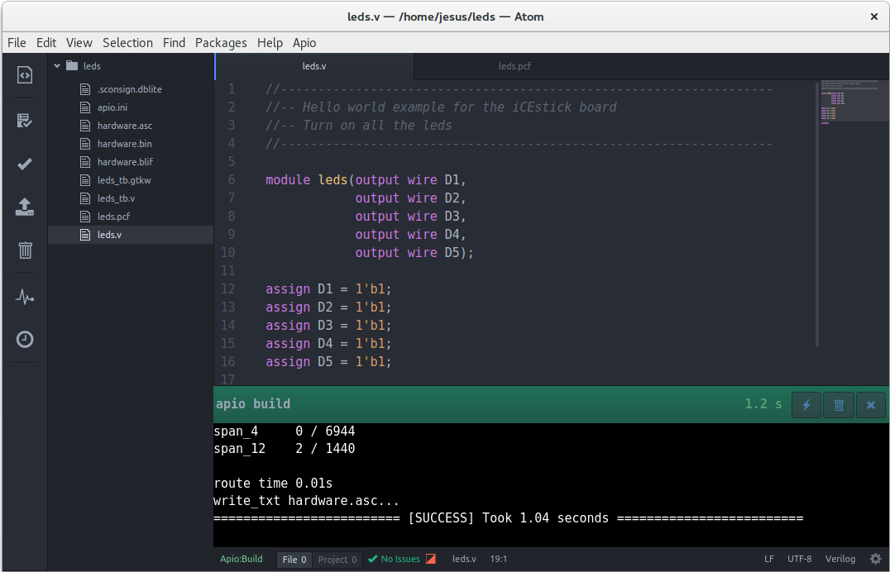
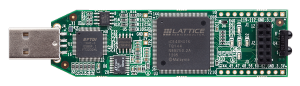
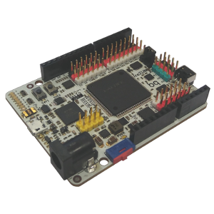
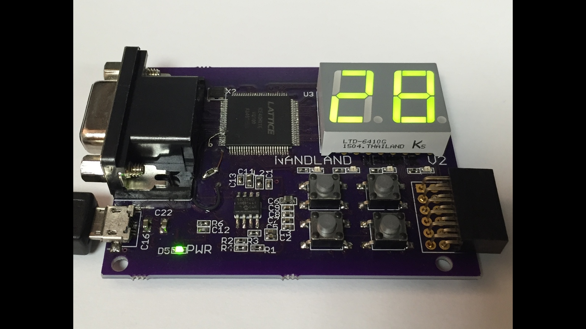
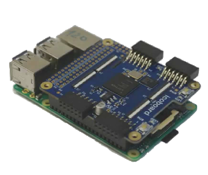
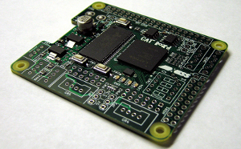

Develop hardware for open FPGAs easily

## Introduction

**Apio-ide** is an Integrated development environment based on [Atom](https://atom.io/), [Apio](https://github.com/FPGAwars/apio) and [Platformio-ide](http://platformio.org/), for developing hardware for the **ICE40 Lattice FPGAs family**. These FPGAs are the first that are supported by a fully opensource toolchain: [Icestorm project](http://www.clifford.at/icestorm/)

Generate the **bistream** from the **Verilog** files, and then upload it into the FPGA

## Documentation

[The documentation is located in the wiki page](https://github.com/FPGAwars/apio-ide/wiki)

## Supported boards

| Picture        | Board          |
| :------------- | :------------- |
|  | [Icestick](http://www.latticesemi.com/icestick) |
|  | [IceZum Alhambra](https://github.com/FPGAwars/icezum/wiki) |
|  | [Nandland go board](https://www.nandland.com/goboard/introduction.html) |
|  | [icoBOARD 1.0](http://icoboard.org/icoboard-1-0.html) |
|  | [iCE40-HX8K ](http://www.latticesemi.com/Products/DevelopmentBoardsAndKits/iCE40HX8KBreakoutBoard.aspx) |
|  | [Cat board ](https://hackaday.io/project/7982-cat-board) |

## License

Released under the GLP v2 license

## Authors
* Juan Gonzalez-Gomez (Obijuan)
* Jesús Arroyo

## Credits
* [Icestorm project](http://www.clifford.at/icestorm/)
* [Platformio-ide](http://platformio.org/)
* [Apio](https://github.com/FPGAwars/apio)
