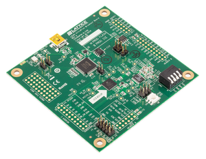
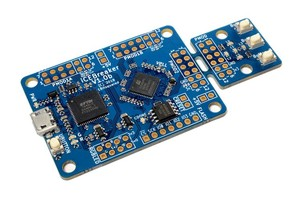
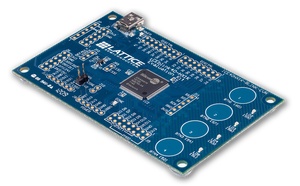
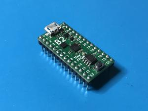
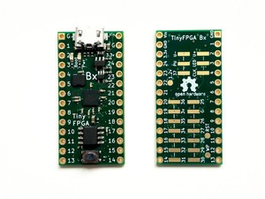
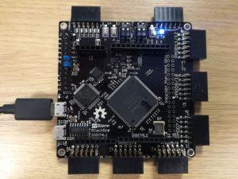
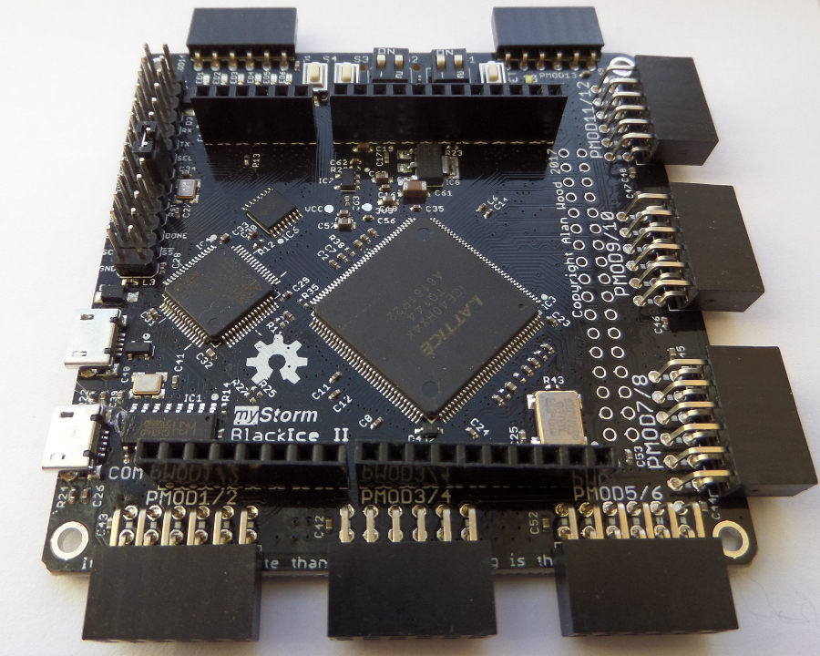
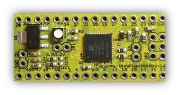
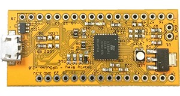

Develop hardware for open FPGAs easily

## Introduction

**Apio IDE** is an Integrated development environment based on [Atom](https://atom.io/), [Apio](https://github.com/FPGAwars/apio) and [Platformio-ide](http://platformio.org/), for developing hardware for the **ICE40 Lattice FPGAs family**. These FPGAs are the first that are supported by a fully opensource toolchain: [Icestorm project](http://www.clifford.at/icestorm/)

Generate the **bistream** from the **Verilog** files, and then upload it into the FPGA

## Documentation

[The documentation is located in the wiki page](https://github.com/FPGAwars/apio-ide/wiki)

## Development

### Debian packaging

You can find the debian scripts to package the full application and all the packages here: https://github.com/set-soft/apio-ide-debian.

Thanks Salvador E. Tropea!

## Supported boards

| Picture        | Board          |
| :------------- | :------------- |
|  | [Icestick](http://www.latticesemi.com/icestick) |
|  | [IceZum Alhambra](https://github.com/FPGAwars/icezum) |
|  | [Alhambra II](https://github.com/FPGAwars/Alhambra-II-FPGA) |
|  | [Nandland go board](https://www.nandland.com/goboard/introduction.html) |
|  | [icoBOARD 1.0](http://icoboard.org/icoboard-1-0.html) |
|  | [iCE40-HX8K ](http://www.latticesemi.com/Products/DevelopmentBoardsAndKits/iCE40HX8KBreakoutBoard.aspx) |
|  | [iCE40-UP5K](http://www.latticesemi.com/en/Products/DevelopmentBoardsAndKits/iCE40UltraPlusBreakoutBoard.aspx) |
|  | [iCE Breaker](https://www.crowdsupply.com/1bitsquared/icebreaker-fpga) |
|  | [iCE Breaker bitsy](https://www.crowdsupply.com/1bitsquared/icebreaker-fpga) |
|  | [ICEBlink40 HX1K](https://www.latticesemi.com/iCEblink40-HX1K) |
|  | [Cat board](https://hackaday.io/project/7982-cat-board) |
|  | [TinyFPGA B2](http://tinyfpga.com/b-series-guide.html) |
|  | [TinyFPGA BX](https://tinyfpga.com/bx/guide.html) |
|  | [BlackIce](https://mystorm.uk/) |
|  | [BlackIce II](https://mystorm.uk/) |
|  | [Upduino](http://www.gnarlygrey.com/) |
|  | [Upduino 2](http://www.gnarlygrey.com/) |
| | FPGA 101 |

## License

Released under the GLP 3.0 license

## Authors

* [Juan González (Obijuan)](https://github.com/Obijuan)
* [Jesús Arroyo Torrens](https://github.com/Jesus89)

## Contributors

* [Salvador E. Tropea](https://github.com/set-soft)
* [Jorge Juan-Chico](https://github.com/jjchico)

## Credits
* [Icestorm project](http://www.clifford.at/icestorm/)
* [Platformio-ide](http://platformio.org/)
* [Apio](https://github.com/FPGAwars/apio)
